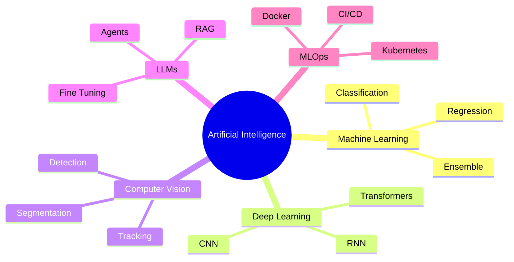

<div align="center">


<br/>


<br/>


<br/>


<br/><br/>

<a href="https://yug-katyal.github.io/Portfolio/">

</a>

<a href="https://www.linkedin.com/in/yug-katyal05/">

</a>

<a href="mailto:yugkatyal.ai@gmail.com">

</a>

<a href="https://github.com/Yug-Katyal">

</a>

<br/><br/>


</div>

---

# About Me

I am an **Artificial Intelligence & Machine Learning undergraduate** with a strong passion for building production-ready intelligent systems that solve real-world problems through data-driven engineering.

My primary interests lie in **Machine Learning**, **Deep Learning**, **Computer Vision**, **Large Language Models**, and **Generative AI**, with a growing focus on designing scalable AI products that bridge research and software engineering.

Currently, I am working as an **AI Intern at CoreOps.AI**, contributing to **Sentinel AI**, an enterprise-scale Video Management System (VMS) supporting intelligent surveillance, live camera monitoring, PPE detection, object detection, and evidence analysis across large-scale deployments.

Alongside industry experience, I actively contribute to **open source** through **GirlScript Summer of Code (GSSoC'26)**, where I have contributed across multiple machine learning repositories, improved ML projects, fixed notebooks, enhanced workflows, and collaborated using professional GitHub development practices.

I enjoy designing complete AI systems—from data collection and annotation to model development, optimization, deployment, and production monitoring.

---

# Open To

| Opportunity | Status |
|------------|--------|
| AI Engineer Internships | ✅ |
| Machine Learning Engineer | ✅ |
| Computer Vision Engineer | ✅ |
| Deep Learning Projects | ✅ |
| Open Source Collaboration | ✅ |
| Research Opportunities | ✅ |
| Generative AI Projects | ✅ |

---

# Tech Stack

## Languages

<p>


</p>

---

## AI / Machine Learning

<p>


</p>

<p>


</p>

---

## Frontend

<p>


</p>

---

## Backend

<p>


</p>

---

## Databases & Tools

<p>


</p>

<p>


</p>

---

# AI / ML Expertise

| Domain | Proficiency | Details |
|---------|------------|---------|
| Machine Learning | ██████████ | Supervised & Unsupervised Learning |
| Deep Learning | █████████ | CNNs, Transfer Learning, EfficientNet |
| Computer Vision | █████████ | OpenCV, YOLOv11, MTCNN |
| Natural Language Processing | ████████ | CountVectorizer, NLTK, Text Processing |
| LLM Engineering | ███████ | Hugging Face, LangChain |
| Model Deployment | ████████ | Streamlit, FastAPI |
| Data Analysis | █████████ | Pandas, NumPy, Visualization |
| MLOps Fundamentals | ███████ | Docker, Kubernetes, Git |
| Data Annotation | █████████ | CVAT, LabelImg |
| Production AI Systems | ███████ | Enterprise Video Intelligence |

---

# Engineering Philosophy

> *"Build AI systems that are accurate, explainable, scalable, and production-ready—not just models that perform well on benchmark datasets."*

---

# Featured Projects
<details>
<summary><h2>🎬 Movie Recommender System</h2></summary>

### Overview

An end-to-end content-based recommendation engine that recommends movies based on textual similarity using metadata from the TMDB dataset. The system leverages NLP techniques to transform movie descriptions into feature vectors and computes cosine similarity to generate highly relevant recommendations through an interactive Streamlit interface.

| Category | Details |
|-----------|---------|
| **Domain** | Recommender Systems · NLP |
| **Tech Stack** | Python, Pandas, Scikit-learn, NLTK, Streamlit |
| **Scale** | Thousands of TMDB movies |
| **Performance** | Instant Top-5 Recommendations |
| **Security** | Local inference with no external API dependency |
| **Impact** | Demonstrates practical NLP-based recommendation pipelines |

### Engineering Highlights

- Built a complete content-based recommendation pipeline.
- Performed feature engineering on movie metadata.
- Applied CountVectorizer and NLTK stemming.
- Generated recommendation vectors using cosine similarity.
- Designed an interactive Streamlit interface.
- Optimized preprocessing for faster recommendation generation.

**Repository**

> https://github.com/Yug-Katyal

</details>

---

<details>
<summary><h2>😷 Real-Time Face Mask Detection System</h2></summary>

### Overview

An enterprise-style Computer Vision application capable of classifying face masks into **Correctly Worn**, **Incorrectly Worn**, and **Not Worn** classes using transfer learning and real-time face detection.

The project focuses on real-world robustness rather than benchmark accuracy by addressing dataset bias and improving out-of-distribution generalization.

| Category | Details |
|-----------|---------|
| **Domain** | Computer Vision |
| **Tech Stack** | Python · TensorFlow · EfficientNetB0 · OpenCV · MTCNN · Streamlit · FastAPI |
| **Scale** | Multi-class Face Dataset |
| **Performance** | 98%+ Test Accuracy with improved real-world robustness |
| **Security** | Local inference with privacy-focused webcam processing |
| **Impact** | Production-ready intelligent safety monitoring |

### Engineering Highlights

- Built a complete real-time inference pipeline.
- Implemented transfer learning using EfficientNetB0.
- Integrated MTCNN for accurate face localization.
- Diagnosed dataset bias through systematic OOD testing.
- Expanded the "Incorrectly Worn" dataset for improved generalization.
- Developed a Streamlit application supporting webcam and image uploads.
- Currently integrating YOLOv8 for multi-person detection.
- Adding Grad-CAM explainability.
- Building FastAPI backend for production deployment.

**Repository**

> https://github.com/Yug-Katyal

</details>

---

<details>
<summary><h2>🦺 Sentinel AI – Enterprise Video Intelligence</h2></summary>

### Overview

Developed AI-powered Computer Vision solutions as part of **CoreOps.AI's Sentinel AI**, an enterprise-scale Video Management System supporting surveillance, intelligent monitoring, PPE compliance, object detection, and evidence analysis across large enterprise deployments.

| Category | Details |
|-----------|---------|
| **Domain** | Enterprise Computer Vision |
| **Tech Stack** | YOLOv11 · Python · CVAT · LabelImg · Docker · Git · Google Colab |
| **Scale** | Enterprise deployments (1000+ cameras) |
| **Performance** | ~30% improvement in detection precision |
| **Security** | Enterprise-ready intelligent monitoring |
| **Impact** | Industrial AI automation |

### Engineering Highlights

- Annotated enterprise datasets using CVAT.
- Built PPE detection datasets.
- Fine-tuned YOLOv11 models.
- Applied augmentation and hyperparameter optimization.
- Improved precision by approximately 30%.
- Conducted model validation and stage testing.
- Worked with Dockerized AI workflows.
- Collaborated using Git and GitHub.

</details>

---

<details>
<summary><h2>🤖 Open Source Machine Learning Contributions</h2></summary>

### Overview

Contributed to multiple Machine Learning repositories during **GirlScript Summer of Code 2026**, improving notebooks, workflows, documentation, reproducibility, automation, and ML project quality.

| Category | Details |
|-----------|---------|
| **Program** | GirlScript Summer of Code 2026 |
| **Repositories** | ML-Capsule · CricScope |
| **Role** | Open Source Contributor |
| **Focus** | ML Engineering · Automation · Documentation |
| **Impact** | Multiple merged contributions |

### Contributions

- Fixed notebook reproducibility issues.
- Added ML projects.
- Improved documentation.
- Created GitHub Actions workflows.
- Enhanced repository automation.
- Collaborated through pull requests and code reviews.
- Followed enterprise Git workflow practices.

</details>

---

# Experience

## AI Intern

### CoreOps.AI — Sentinel AI (Enterprise Video Intelligence Platform)

**June 2026 – Present**

Working on enterprise-scale Computer Vision systems for intelligent surveillance and industrial AI applications.

### Responsibilities

- Fine-tuning YOLOv11 object detection models
- Data annotation using CVAT & LabelImg
- Hyperparameter optimization
- Dataset collection and augmentation
- PPE Detection
- Electronics detection
- Model validation
- Stage testing
- Bug identification
- Dockerized development
- Git collaboration
- Database management using PgAdmin

### Technologies

`Python`
`YOLOv11`
`OpenCV`
`Docker`
`Git`
`GitHub`
`Google Colab`
`CVAT`
`LabelImg`
`PgAdmin`

---

# Open Source Contributions

## GirlScript Summer of Code 2026

### Contributor

Worked on collaborative Machine Learning repositories following professional software engineering workflows.

### Contributions

- ML-Capsule
- CricScope
- GitHub Actions
- Documentation
- Bug Fixes
- Notebook Improvements
- Workflow Automation
- Machine Learning Pipelines
- Code Reviews

### Technologies

`Git`

`GitHub`

`Machine Learning`

`Open Source`

`Python`

`Docker`

---

# Achievements

<div align="center">

| Recognition | Details |
|--------------|---------|
| 🏆 AI Intern | Selected as AI Intern at CoreOps.AI |
| ⭐ Open Source | Active GirlScript Summer of Code 2026 Contributor |
| 🎓 Outstanding Scholar | AISSE Award (Class X) |
| 🎵 State Level Winner | First Position in Indian Classical Singing |
| 👥 Leadership | Led Music Society events for 500+ audience |
| 🚀 Production AI | Built multiple end-to-end AI applications |

</div>

---

# Certifications

## IIT Roorkee


---

## Core Skills


---

# Professional Highlights

- ✔ Production-ready AI systems
- ✔ Enterprise Computer Vision
- ✔ Deep Learning
- ✔ Transfer Learning
- ✔ YOLO Object Detection
- ✔ NLP Applications
- ✔ Open Source Contributor
- ✔ Dockerized AI Workflows
- ✔ FastAPI Backend Development
- ✔ GitHub Collaboration
- ✔ Scalable AI Engineering

---

# Coding Profiles
<div align="center">

# Coding Profiles

<a href="https://leetcode.com/u/Yugkatyal/">

</a>

<a href="https://www.geeksforgeeks.org/user/">

</a>

<a href="https://www.hackerrank.com/">

</a>

<a href="https://www.codechef.com/">

</a>

</div>

---

# GitHub Analytics

<div align="center">


</div>

<br/>

<div align="center">


</div>

# GitHub Trophies

<div align="center">


</div>

---

# Contribution Activity

<div align="center">


</div>

---


# Current Focus

```yaml
Learning:
  - Advanced Computer Vision
  - Large Language Models
  - Agentic AI
  - Multimodal AI
  - MLOps
  - Kubernetes
  - Distributed Deep Learning

Building:
  - Enterprise AI Applications
  - Intelligent Video Analytics
  - Computer Vision Systems
  - AI Powered Web Applications
  - Open Source Projects

Exploring:
  - LangGraph
  - AI Agents
  - RAG Systems
  - Vision Language Models
  - LLM Fine-Tuning
  - AI Infrastructure

Open To:
  - AI Engineer Roles
  - Machine Learning Internships
  - Open Source Collaboration
  - Research Projects
  - Freelance AI Development
```

---

# Engineering Principles

| Principle | Description |
|-----------|-------------|
| **Scalability** | Design systems that grow with increasing workloads |
| **Maintainability** | Write clean, modular, and reusable code |
| **Performance** | Optimize models for production inference |
| **Reliability** | Build robust and fault-tolerant AI systems |
| **Explainability** | Prefer interpretable and trustworthy AI |
| **Continuous Learning** | Keep improving through experimentation and open source |

---

# Development Workflow

```text
Idea
 │
 ▼
Research
 │
 ▼
Data Collection
 │
 ▼
Data Cleaning
 │
 ▼
Model Development
 │
 ▼
Training
 │
 ▼
Evaluation
 │
 ▼
Optimization
 │
 ▼
Deployment
 │
 ▼
Monitoring
 │
 ▼
Continuous Improvement
```

---

# Currently Working On

- Enterprise Computer Vision
- YOLOv11 Optimization
- Face Mask Detection System
- PPE Detection
- AI-Powered Video Analytics
- FastAPI Backends
- LangChain Applications
- Open Source Contributions
- Production ML Pipelines

---

# Areas of Interest

- Artificial Intelligence
- Machine Learning
- Deep Learning
- Computer Vision
- Large Language Models
- Generative AI
- AI Agents
- NLP
- MLOps
- Distributed Systems
- Backend Engineering
- Software Engineering

---

# Fun Facts

- 🎯 Passionate about solving real-world problems using AI.
- 🚀 Love building production-ready ML systems.
- 📚 Constantly learning emerging AI technologies.
- 🤝 Enjoy collaborating on open-source projects.
- 🎵 State-level Indian Classical Singing winner.
- 👨‍💻 Always experimenting with new AI frameworks.

---

# Let's Connect

<div align="center">

<a href="mailto:yugkatyal.ai@gmail.com">


</a>

<a href="https://www.linkedin.com/in/yug-katyal05/">


</a>

<a href="https://github.com/Yug-Katyal">


</a>

<a href="https://yug-katyal.github.io/Portfolio/">


</a>

</div>

---

<div align="center">

### *"Building intelligent systems that create measurable real-world impact."*


</div>
---

# Tech Expertise Matrix

<div align="center">

| Engineering Domain | Level | Technologies |
|:-------------------|:----:|:-------------|
| Artificial Intelligence | ██████████ | ML • DL • Computer Vision |
| Machine Learning | ██████████ | Scikit-learn • TensorFlow • PyTorch |
| Deep Learning | █████████ | CNN • Transfer Learning • EfficientNet |
| Computer Vision | █████████ | OpenCV • YOLO • MTCNN |
| NLP | ████████ | NLTK • CountVectorizer |
| LLM Engineering | ███████ | Hugging Face • LangChain |
| Backend Development | ███████ | FastAPI |
| DevOps | ██████ | Docker • Kubernetes |
| Data Engineering | ████████ | Pandas • NumPy |
| Software Engineering | ████████ | Git • GitHub • DSA |

</div>

---

# Featured Repositories

<div align="center">

<a href="https://github.com/Yug-Katyal">


</a>

<a href="https://github.com/Yug-Katyal">


</a>

</div>

<br>

<div align="center">

<a href="https://github.com/Yug-Katyal">


</a>

<a href="https://github.com/Yug-Katyal">


</a>

</div>

<br>

<div align="center">

<a href="https://github.com/Yug-Katyal">


</a>

<a href="https://github.com/Yug-Katyal">


</a>

</div>

---

# AI Engineering Journey

```text
2024
│
├── Started B.Tech AI & ML
│
├── Python
│
├── Machine Learning
│
├── Data Analysis
│
▼

2025
│
├── Deep Learning
├── CNNs
├── TensorFlow
├── PyTorch
├── Streamlit
├── NLP
│
▼

2026
│
├── AI Intern @ CoreOps.AI
├── YOLOv11
├── Enterprise AI
├── FastAPI
├── Docker
├── Open Source (GSSoC)
│
▼

Future
│
├── LLM Engineer
├── GenAI Engineer
├── Agentic AI
├── Multimodal AI
├── MLOps
└── AI Research
```

---

# Workflow

```text
Problem Statement
        │
        ▼
 Literature Review
        │
        ▼
 Data Collection
        │
        ▼
 Data Annotation
        │
        ▼
 Feature Engineering
        │
        ▼
 Model Development
        │
        ▼
 Hyperparameter Tuning
        │
        ▼
 Model Evaluation
        │
        ▼
 Explainability
        │
        ▼
 Deployment
        │
        ▼
 Monitoring
```

---

# AI Toolbox

<div align="center">

| Category | Technologies |
|----------|--------------|
| Programming | Python · C · C++ · JavaScript |
| ML Libraries | Scikit-learn · TensorFlow · PyTorch |
| CV | OpenCV · YOLO · MTCNN |
| NLP | NLTK · LangChain · Hugging Face |
| Backend | FastAPI |
| Deployment | Streamlit |
| DevOps | Docker · Kubernetes |
| Monitoring | Grafana · Prometheus |
| Messaging | Kafka |
| Annotation | CVAT · LabelImg |
| Version Control | Git · GitHub |

</div>

---

# Open Source Philosophy

> **Open source is more than writing code.**
>
> It is about collaborating, reviewing, documenting, learning from experienced engineers, and continuously improving software that benefits everyone.

---

# 2026 Goals

- ✅ Reach 1000+ GitHub contributions
- ✅ Publish production-grade AI projects
- ✅ Master Computer Vision
- ✅ Learn Agentic AI
- ✅ Learn LangGraph
- ✅ Master LLM Fine-tuning
- ✅ Build scalable FastAPI services
- ✅ Deploy cloud-native AI systems
- ✅ Contribute to major open-source repositories
- ✅ Secure an AI Engineer role

---

# What Makes Me Different

<div align="center">

| Strength | Description |
|-----------|-------------|
| 🚀 Production Mindset | Focus on deployable AI rather than notebook-only models |
| 📈 Continuous Improvement | Constantly iterate based on real-world feedback |
| 🔍 Problem Solver | Analyze root causes instead of symptoms |
| 🤝 Team Player | Comfortable with Git workflows and code reviews |
| 📚 Fast Learner | Quickly adapt to new frameworks and tools |
| 💡 Engineering First | Build maintainable, scalable software |

</div>

---

# Learning Roadmap



---

# Quote

> *"Artificial Intelligence is not about replacing people. It's about amplifying human potential through intelligent engineering."*

---

<div align="center">

### ⭐ If you like my work, consider following my journey and exploring my repositories!

</div>
